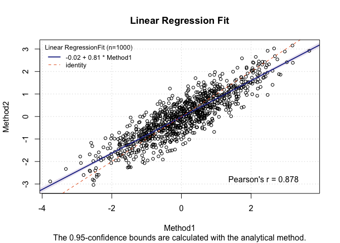
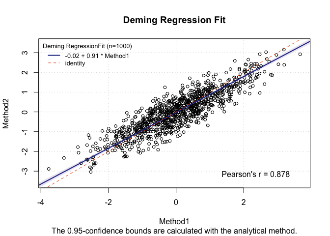
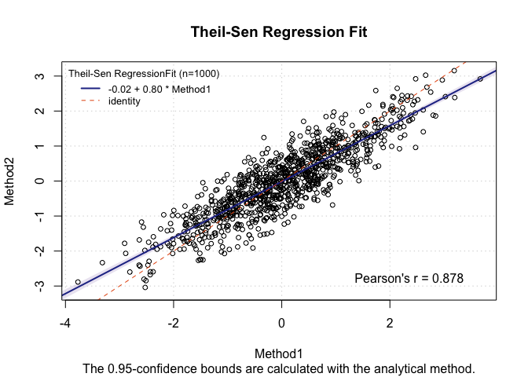
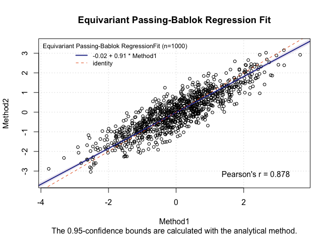

Exploratie met het MCR package
================
2026-03-15

# Regressie methoden uit het `mcr` package

``` r
library(tidyverse)
library(mcr)
```

We nemen dezelfde setup als bij de paper van Frost & Thompson:

``` r
set.seed(123)

# notatie uit het artikel
N <- 1000 # aantal stat. units in de studie
n <- 50 # aantal stat. units in de sub-studie met herhaalde metingen
mu <- 0 # gemiddelde van de echte predictor (X)
sigma2_b <- 1 # variantie van de echte predictor (X)
x <- rnorm(N, mu, sqrt(sigma2_b)) # gerealiseerde waarden van de predictor
sigma2_w <- .2 # variantie van de meetfouten in X
u <- rnorm(N, 0, sqrt(sigma2_w)) # gerealiseerde meetfouten in X
w <- x + u # waargenomen predictor = predictor + meetfout
alpha_star <- 0 # intercept voor relatie Y ~ X
beta_star  <- 1 # slope voor relatie Y ~ X
phi2  <- .1 # residuele variantie voor de relatie Y ~ X
delta <- rnorm(N, 0, sqrt(phi2)) # residuele error Y
y <- alpha_star + beta_star * x + delta # uitkomst variabele

# data.frame met ID's voor de stat. units
data.df <- data.frame(y, x, w) %>%
  mutate(Id = paste0("ID_", 1:N), .before = y)

# subject-Ids voor de substudie
idx_substudy <- sample(data.df$Id, n, replace = F)
nms <- 3 # herhaalde metingen per subject, dit hoeft niet per se hetzelfde aantal te zijn per subject

# data.frame met herhaalde metingen w per subject:
data.df.sub <- data.df %>%
  filter(Id %in% idx_substudy) %>%
  expand_grid(Id.sub = 1:nms) %>%
  mutate(
    # behoud w_1 en trek nieuwe steekproef voor extra herhaalde metingen
    w = case_when(Id.sub == 1 ~ w,
                  TRUE        ~ NA_real_),
    w = coalesce(w, rnorm(n(), x, sqrt(sigma2_w)))
  )
```

<br>

## Resultaten met verschillende regressie-methoden

### Lineaire regressie

``` r
m1 <- with(data.df, mcreg(w, y, 
                          method.reg = "LinReg",
                          method.ci = "analytical"))
plot(m1)
```

<!-- -->
\### Deming regressie

``` r
m2 <- with(data.df, mcreg(w, y, 
                          method.reg = "Deming",
                          method.ci = "analytical"))
plot(m2)
```

<!-- -->

### Theil-Sen regressie

``` r
m3 <- with(data.df, mcreg(w, y, 
                          method.reg = "TS",
                          method.ci = "analytical"))
plot(m3)
```

<!-- -->

### Passing-Bablok regressie

``` r
m4 <- with(data.df, mcreg(w, y, 
                          method.reg = "PBequi",
                          method.ci = "analytical"))
plot(m4)
```

<!-- -->
