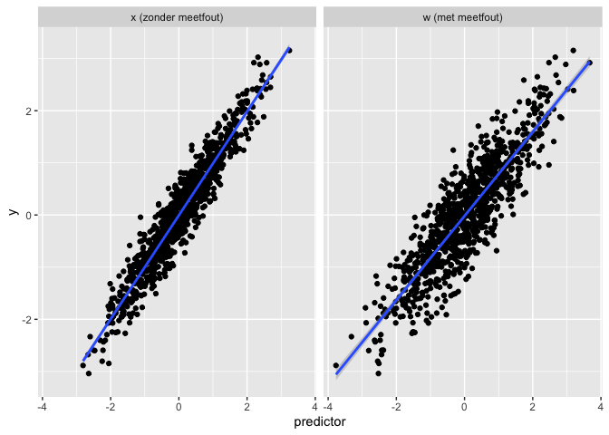
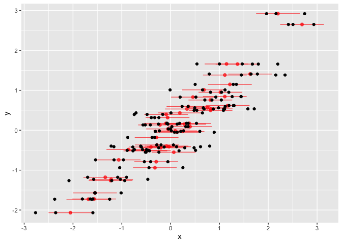
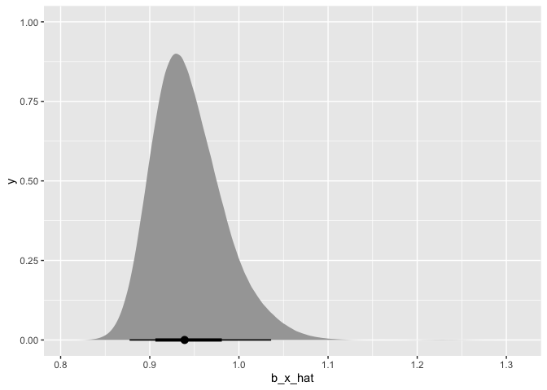

Regressie dilutie
================
2026-03-06

``` r
library(tidyverse)
library(lme4)
library(brms)
library(tidybayes)
```

# Frost & Thompson (2000) J. R. Stat. Soc. A

We beginnen met enkele notatie’s uit het artikel en waarden toe te
kennen aan enkele parameters en data te simuleren. We zijn
geïnteresseerd in de relatie tussen uitkomst variabele $Y$ en een enkele
predictor $X$ (bv. $Y$ = referentiemethode en $X$ =
niet-referentiemethod).

``` r
set.seed(123)

# notatie uit het artikel
N <- 1000 # aantal stat. units in de studie
n <- 50 # aantal stat. units in de sub-studie met herhaalde metingen
mu <- 0 # gemiddelde van de echte predictor (X)
sigma2_b <- 1 # variantie van de echte predictor (X)
x <- rnorm(N, mu, sqrt(sigma2_b)) # gerealiseerde waarden van de predictor
sigma2_w <- .2 # variantie van de meetfouten in X
u <- rnorm(N, 0, sqrt(sigma2_w)) # gerealiseerde meetfouten in X
w <- x + u # waargenomen predictor = predictor + meetfout
alpha_star <- 0 # intercept voor relatie Y ~ X
beta_star  <- 1 # slope voor relatie Y ~ X
phi2  <- .1 # residuele variantie voor de relatie Y ~ X
delta <- rnorm(N, 0, sqrt(phi2)) # residuele error Y
y <- alpha_star + beta_star * x + delta # uitkomst variabele

# data.frame met ID's voor de stat. units
data.df <- data.frame(y, x, w) %>%
  mutate(Id = paste0("ID_", 1:N), .before = y)
```

We kunnen zien dat er inderdaad dilutie is van de relatie tussen beide,
de Pearson correlatie is kleiner en de slope is minder steil.

``` r
# Y ~ X (predictor zonder meetfout)
cor(y, x)
```

    ## [1] 0.9541238

``` r
coef(lm(y ~ x, data = data.df))
```

    ##  (Intercept)            x 
    ## -0.006262883  0.993969672

``` r
# Y ~ W (geobserveerde predictor)
cor(y, w)
```

    ## [1] 0.8778581

``` r
coef(m0 <- lm(y ~ w, data = data.df))
```

    ## (Intercept)           w 
    ## -0.01855281  0.80641859

<!-- -->

Als we nu de correctie-factor $\lambda$ berekenen met de echte waarden
van de variantie parameters, dan kunnen we de regressie dilutie
corrigeren:

``` r
lambda <- (sigma2_b + sigma2_w) / sigma2_b
lambda
```

    ## [1] 1.2

``` r
beta_hat1 <- unname(coef(m0)["w"] * lambda)
beta_hat1 # beta_hat1 ligt dus dicht bij beta_star (=1) na correctie voor dilutie
```

    ## [1] 0.9677023

In realiteit kennen we de echte waarden van de varianties niet en moeten
we $\lambda$ schatten obv een substudie of een volledig onafhankelijke
studie met herhaalde metingen van de predictor op dezelfde statistische
units.

``` r
# subject-Ids voor de substudie
idx_substudy <- sample(data.df$Id, n, replace = F)
nms <- 3 # herhaalde metingen per subject, dit hoeft niet per se hetzelfde aantal te zijn per subject

# data.frame met herhaalde metingen w per subject:
data.df.sub <- data.df %>%
  filter(Id %in% idx_substudy) %>%
  select(-w) %>% # verwijder w om per subject nms w's te samplen
  expand_grid(Id.sub = 1:nms) %>%
  mutate(w = rnorm(n(), x, sqrt(sigma2_w)))
```

Onderstaande figuur toont de data van de substudie. De zwarte punten
zijn de herhaalde metingen van de predictor. De rode punten met
horizontale errorbars zijn niet waargenomen in de (sub-)studie maar
geven de echte waarde van de predictor weer (rood punt) en de
onzekerheid van de predictor (+/- 1 SD van de meetfout op de predictor).

<!-- -->

Deze data kunnen we gebruiken om de correctie-factor te schatten. Frost
& Thompson presenteren verschillende methoden, maar hier concentreren we
enkel op de methode obv de ICC omdat die als meest efficiënt naar voor
komt uit hun analyse en het makkelijkst toepasbaar is en
generaliseerbaar naar veel situaties.

``` r
# mixed model (fit with REML):
m.sub  <- lmer(w ~ 1 + (1|Id), data = data.df.sub)
( RE.cov <- as.data.frame(VarCorr(m.sub)) )
```

    ##        grp        var1 var2      vcov     sdcor
    ## 1       Id (Intercept) <NA> 1.0538596 1.0265766
    ## 2 Residual        <NA> <NA> 0.1759026 0.4194075

``` r
( ICC <- RE.cov$vcov[1] / sum(RE.cov$vcov) )
```

    ## [1] 0.8569621

``` r
( lambda_hat <- 1/ICC )
```

    ## [1] 1.166913

Hiermee kunnen we dan $\hat{\beta^*}$ schatten als
$\hat{\beta} \hat{\lambda}$.

``` r
( beta_star_hat <- unname(coef(m0)["w"] * lambda_hat) )
```

    ## [1] 0.9410202

Frost & Thompson presenteren ook de method om een 95% CI te berekenen
voor $\hat{\beta^*}$ die zowel rekening houdt met de onzekerheid op de
correctie-factor als met de onzekerheid in het lineair model (obv
Fieller’s theorema).

``` r
var_lambda_hat    <- (lambda_hat^2 - 1)^2 / n
var_invlambda_hat <- var_lambda_hat / lambda_hat^4
f0 <- unname(coef(m0)["w"])^2 - qnorm(.975)^2 * vcov(m0)["w","w"]
f1 <- unname(coef(m0)["w"]) / lambda_hat # negeer covariantie studie & substudie
f2 <- 1 / lambda_hat^2 - qnorm(.975)^2 * var_invlambda_hat

beta_star_hatCI <- (f1 + c(-1, 1) * sqrt(f1^2 - f0*f2)) / f2

tibble(
  estimate = beta_star_hat,
  ll       = beta_star_hatCI[1],
  ul       = beta_star_hatCI[2]
) %>% knitr::kable()
```

|  estimate |        ll |       ul |
|----------:|----------:|---------:|
| 0.9410202 | 0.8605215 | 1.035513 |

<br>

# Bayesiaanse inferentie

We proberen nu dezelfde methode te volgen, maar met Bayesiaanse
inferentie. We fitten eerst beide regressie modellen met default priors
uit het `brms` package.

``` r
# suppress messages after inspection of models
# model voor Y ~ W (hoofdstudie)
m0.bayes <- brm(y ~ w, data = data.df,
                chains = 4, iter = 2000, warmup = 1000,
                silent = 2, refresh = 0)
```

    ## Running /Library/Frameworks/R.framework/Resources/bin/R CMD SHLIB foo.c
    ## using C compiler: ‘Apple clang version 17.0.0 (clang-1700.6.4.2)’
    ## using SDK: ‘MacOSX26.2.sdk’
    ## clang -arch arm64 -std=gnu2x -I"/Library/Frameworks/R.framework/Resources/include" -DNDEBUG   -I"/Users/ben/Library/Caches/org.R-project.R/R/renv/cache/v5/macos/R-4.5/aarch64-apple-darwin20/Rcpp/1.1.1/60df6f11cbeffbf9d50ad0852867f6b6/Rcpp/include/"  -I"/Users/ben/Documents/INBO/voorbereiding INBO/regression_dilution/testsuit_regression_dilution/renv/library/macos/R-4.5/aarch64-apple-darwin20/RcppEigen/include/"  -I"/Users/ben/Documents/INBO/voorbereiding INBO/regression_dilution/testsuit_regression_dilution/renv/library/macos/R-4.5/aarch64-apple-darwin20/RcppEigen/include/unsupported"  -I"/Users/ben/Documents/INBO/voorbereiding INBO/regression_dilution/testsuit_regression_dilution/renv/library/macos/R-4.5/aarch64-apple-darwin20/BH/include" -I"/Users/ben/Library/Caches/org.R-project.R/R/renv/cache/v5/macos/R-4.5/aarch64-apple-darwin20/StanHeaders/2.32.10/c35dc5b81d7ffb1018aa090dff364ecb/StanHeaders/include/src/"  -I"/Users/ben/Library/Caches/org.R-project.R/R/renv/cache/v5/macos/R-4.5/aarch64-apple-darwin20/StanHeaders/2.32.10/c35dc5b81d7ffb1018aa090dff364ecb/StanHeaders/include/"  -I"/Users/ben/Library/Caches/org.R-project.R/R/renv/cache/v5/macos/R-4.5/aarch64-apple-darwin20/RcppParallel/5.1.11-1/07d228a359f31d8aebe6d2f643c1f012/RcppParallel/include/"  -I"/Users/ben/Library/Caches/org.R-project.R/R/renv/cache/v5/macos/R-4.5/aarch64-apple-darwin20/rstan/2.32.7/5f47b80f0db40503697eef138a31a6ef/rstan/include" -DEIGEN_NO_DEBUG  -DBOOST_DISABLE_ASSERTS  -DBOOST_PENDING_INTEGER_LOG2_HPP  -DSTAN_THREADS  -DUSE_STANC3 -DSTRICT_R_HEADERS  -DBOOST_PHOENIX_NO_VARIADIC_EXPRESSION  -D_HAS_AUTO_PTR_ETC=0  -include '/Users/ben/Library/Caches/org.R-project.R/R/renv/cache/v5/macos/R-4.5/aarch64-apple-darwin20/StanHeaders/2.32.10/c35dc5b81d7ffb1018aa090dff364ecb/StanHeaders/include/stan/math/prim/fun/Eigen.hpp'  -D_REENTRANT -DRCPP_PARALLEL_USE_TBB=1   -I/opt/R/arm64/include    -fPIC  -falign-functions=64 -Wall -g -O2  -c foo.c -o foo.o
    ## In file included from <built-in>:1:
    ## In file included from /Users/ben/Library/Caches/org.R-project.R/R/renv/cache/v5/macos/R-4.5/aarch64-apple-darwin20/StanHeaders/2.32.10/c35dc5b81d7ffb1018aa090dff364ecb/StanHeaders/include/stan/math/prim/fun/Eigen.hpp:22:
    ## In file included from /Users/ben/Documents/INBO/voorbereiding INBO/regression_dilution/testsuit_regression_dilution/renv/library/macos/R-4.5/aarch64-apple-darwin20/RcppEigen/include/Eigen/Dense:1:
    ## In file included from /Users/ben/Documents/INBO/voorbereiding INBO/regression_dilution/testsuit_regression_dilution/renv/library/macos/R-4.5/aarch64-apple-darwin20/RcppEigen/include/Eigen/Core:19:
    ## /Users/ben/Documents/INBO/voorbereiding INBO/regression_dilution/testsuit_regression_dilution/renv/library/macos/R-4.5/aarch64-apple-darwin20/RcppEigen/include/Eigen/src/Core/util/Macros.h:679:10: fatal error: 'cmath' file not found
    ##   679 | #include <cmath>
    ##       |          ^~~~~~~
    ## 1 error generated.
    ## make: *** [foo.o] Error 1

``` r
# mixed model voor W (substudie)
# hier was meer verdunning nodig (hoge acf, kleine ESS)
m.sub.bayes <- brm(w ~ 1 + (1|Id), data = data.df.sub,
                   chains = 4, iter = 5000, warmup = 1000, thin = 10,
                   control = list(adapt_delta = 0.9),
                   silent = 2, refresh = 0)
```

    ## Running /Library/Frameworks/R.framework/Resources/bin/R CMD SHLIB foo.c
    ## using C compiler: ‘Apple clang version 17.0.0 (clang-1700.6.4.2)’
    ## using SDK: ‘MacOSX26.2.sdk’
    ## clang -arch arm64 -std=gnu2x -I"/Library/Frameworks/R.framework/Resources/include" -DNDEBUG   -I"/Users/ben/Library/Caches/org.R-project.R/R/renv/cache/v5/macos/R-4.5/aarch64-apple-darwin20/Rcpp/1.1.1/60df6f11cbeffbf9d50ad0852867f6b6/Rcpp/include/"  -I"/Users/ben/Documents/INBO/voorbereiding INBO/regression_dilution/testsuit_regression_dilution/renv/library/macos/R-4.5/aarch64-apple-darwin20/RcppEigen/include/"  -I"/Users/ben/Documents/INBO/voorbereiding INBO/regression_dilution/testsuit_regression_dilution/renv/library/macos/R-4.5/aarch64-apple-darwin20/RcppEigen/include/unsupported"  -I"/Users/ben/Documents/INBO/voorbereiding INBO/regression_dilution/testsuit_regression_dilution/renv/library/macos/R-4.5/aarch64-apple-darwin20/BH/include" -I"/Users/ben/Library/Caches/org.R-project.R/R/renv/cache/v5/macos/R-4.5/aarch64-apple-darwin20/StanHeaders/2.32.10/c35dc5b81d7ffb1018aa090dff364ecb/StanHeaders/include/src/"  -I"/Users/ben/Library/Caches/org.R-project.R/R/renv/cache/v5/macos/R-4.5/aarch64-apple-darwin20/StanHeaders/2.32.10/c35dc5b81d7ffb1018aa090dff364ecb/StanHeaders/include/"  -I"/Users/ben/Library/Caches/org.R-project.R/R/renv/cache/v5/macos/R-4.5/aarch64-apple-darwin20/RcppParallel/5.1.11-1/07d228a359f31d8aebe6d2f643c1f012/RcppParallel/include/"  -I"/Users/ben/Library/Caches/org.R-project.R/R/renv/cache/v5/macos/R-4.5/aarch64-apple-darwin20/rstan/2.32.7/5f47b80f0db40503697eef138a31a6ef/rstan/include" -DEIGEN_NO_DEBUG  -DBOOST_DISABLE_ASSERTS  -DBOOST_PENDING_INTEGER_LOG2_HPP  -DSTAN_THREADS  -DUSE_STANC3 -DSTRICT_R_HEADERS  -DBOOST_PHOENIX_NO_VARIADIC_EXPRESSION  -D_HAS_AUTO_PTR_ETC=0  -include '/Users/ben/Library/Caches/org.R-project.R/R/renv/cache/v5/macos/R-4.5/aarch64-apple-darwin20/StanHeaders/2.32.10/c35dc5b81d7ffb1018aa090dff364ecb/StanHeaders/include/stan/math/prim/fun/Eigen.hpp'  -D_REENTRANT -DRCPP_PARALLEL_USE_TBB=1   -I/opt/R/arm64/include    -fPIC  -falign-functions=64 -Wall -g -O2  -c foo.c -o foo.o
    ## In file included from <built-in>:1:
    ## In file included from /Users/ben/Library/Caches/org.R-project.R/R/renv/cache/v5/macos/R-4.5/aarch64-apple-darwin20/StanHeaders/2.32.10/c35dc5b81d7ffb1018aa090dff364ecb/StanHeaders/include/stan/math/prim/fun/Eigen.hpp:22:
    ## In file included from /Users/ben/Documents/INBO/voorbereiding INBO/regression_dilution/testsuit_regression_dilution/renv/library/macos/R-4.5/aarch64-apple-darwin20/RcppEigen/include/Eigen/Dense:1:
    ## In file included from /Users/ben/Documents/INBO/voorbereiding INBO/regression_dilution/testsuit_regression_dilution/renv/library/macos/R-4.5/aarch64-apple-darwin20/RcppEigen/include/Eigen/Core:19:
    ## /Users/ben/Documents/INBO/voorbereiding INBO/regression_dilution/testsuit_regression_dilution/renv/library/macos/R-4.5/aarch64-apple-darwin20/RcppEigen/include/Eigen/src/Core/util/Macros.h:679:10: fatal error: 'cmath' file not found
    ##   679 | #include <cmath>
    ##       |          ^~~~~~~
    ## 1 error generated.
    ## make: *** [foo.o] Error 1

De samples van de slope parameter uit de posterior van het model
`m0.bayes` vermenigvuldigen we met de samples van de correctie-factor
uit de posterior van het andere model (`m.sub.bayes`) om zo tot de
gecorrigeerde slope parameter te komen. Deze schatting en het 95% CrI
liggen dicht bij de waarden bekomen met klassieke inferentie.

``` r
samples.b_w <- m0.bayes %>%
  spread_draws(b_w)

samples.ICC_lambda <- m.sub.bayes %>%
  spread_draws(sd_Id__Intercept, sigma) %>%
  mutate(
    icc = sd_Id__Intercept^2 / (sd_Id__Intercept^2 + sigma^2),
    lambda = 1 / icc
  )

samples.b_x <- expand_grid(
  b_w = samples.b_w$b_w,
  lambda = samples.ICC_lambda$lambda
) %>%
  mutate(b_x_hat = b_w * lambda)

samples.b_x %>%
  ggplot(aes(b_x_hat)) +
  stat_halfeye()
```

<!-- -->

``` r
median_qi(samples.b_x$b_x_hat) %>% knitr::kable()
```

|         y |      ymin |     ymax | .width | .point | .interval |
|----------:|----------:|---------:|-------:|:-------|:----------|
| 0.9390701 | 0.8773828 | 1.036126 |   0.95 | median | qi        |

# Bayesiaanse inferentie (2)

mi() functie uit brms?
