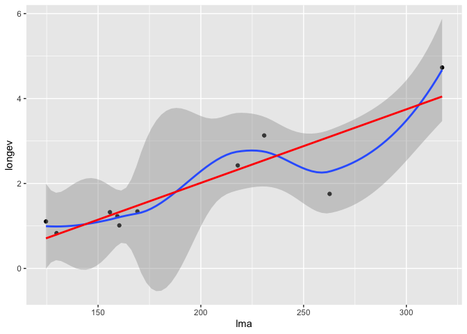
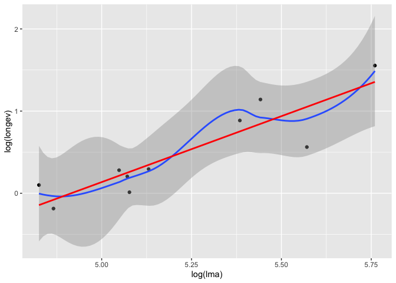
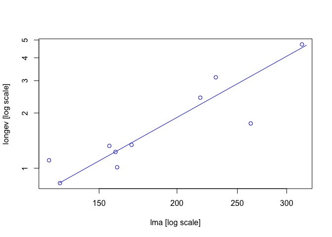
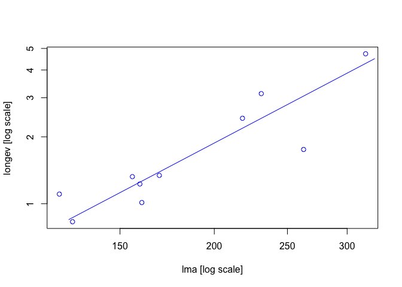
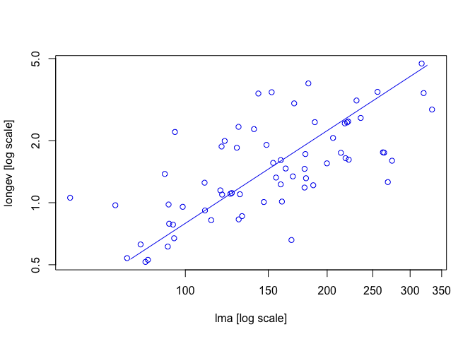
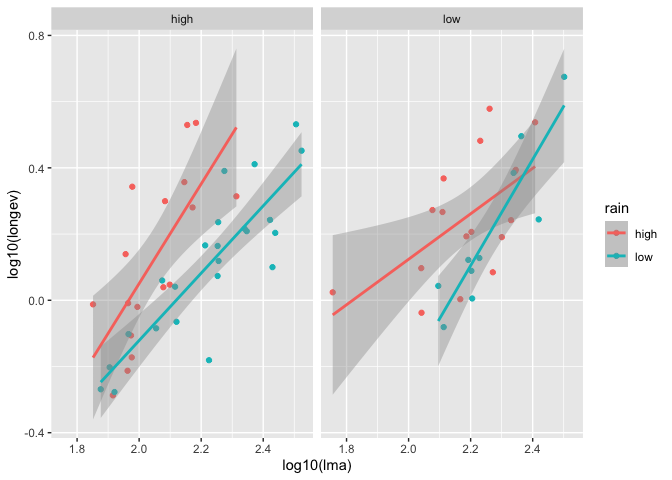
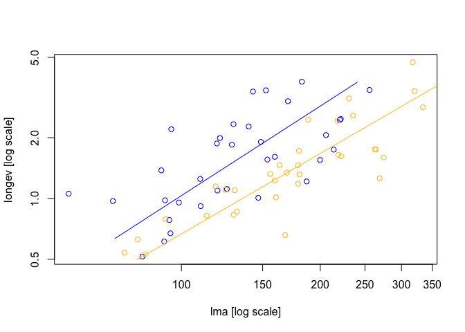
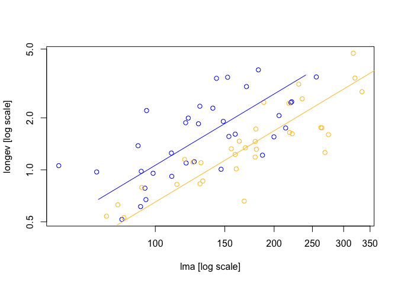
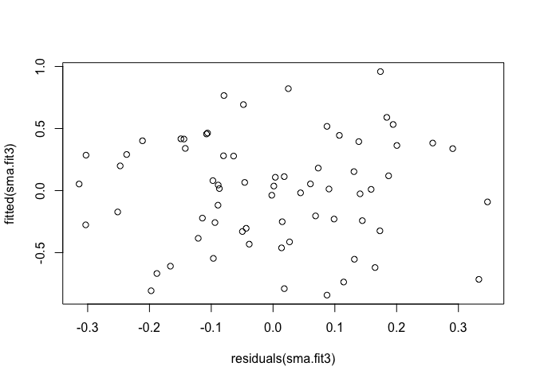
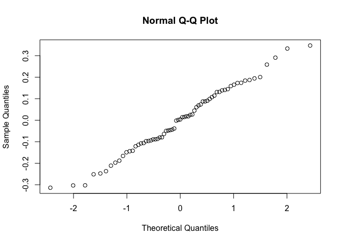

smatr3 package: (Standardized) Major Axis (PCA)
================
2026-03-09

``` r
library(tidyverse)
library(smatr)
```

# Warton et al. (2006) Biol. Rev.

Samenvatting van de methoden uit Warton et al. Er is een R package
beschikbaar die de (S)MA methodologie beschikbaar maakt: `smatr`. De
methode van MA en SMA is gelijkaardig aan PCA en PCA op
gestandaardiseerde data. Er wordt dus geen onderscheid gemaakt tussen
uitkomst/predictor (symmetrie).

``` r
data("leaflife")
data("leafmeas")
```

``` r
# Extract only low-nutrient, low-rainfall data from leaflife dataset:
leaf.low <- subset(leaflife, soilp == 'low' & rain == 'low')

ggplot(leaf.low, aes(lma, longev)) +
  geom_point() +
  geom_smooth() +
  geom_smooth(method = "lm", se = F, color = "red")
```

<!-- -->

``` r
ggplot(leaf.low, aes(log(lma), log(longev))) +
  geom_point() +
  geom_smooth() +
  geom_smooth(method = "lm", se = F, color = "red")
```

<!-- -->

``` r
# Fit a single MA for log(leaf longevity) vs log(leaf mass per area):
ma.fit <- ma(longev ~ lma, log='xy', data=leaf.low)
summary(ma.fit)
```

    ## Call: sma(formula = ..1, data = ..3, log = "xy", method = "MA") 
    ## 
    ## Fit using Major Axis 
    ## 
    ## These variables were log-transformed before fitting: xy 
    ## 
    ## Confidence intervals (CI) are at 95%
    ## 
    ## ------------------------------------------------------------
    ## Coefficients:
    ##             elevation    slope
    ## estimate    -4.081284 1.894043
    ## lower limit -5.797361 1.305123
    ## upper limit -2.365208 3.040484
    ## 
    ## H0 : variables uncorrelated
    ## R-squared : 0.80651 
    ## P-value : 0.00041709

``` r
plot(ma.fit)
```

<!-- -->

``` r
# Fit a single SMA for log(leaf longevity) vs log(leaf mass per area):
sma.fit <- sma(longev ~ lma, log='xy', data=leaf.low)
summary(sma.fit)
```

    ## Call: sma(formula = longev ~ lma, data = leaf.low, log = "xy") 
    ## 
    ## Fit using Standardized Major Axis 
    ## 
    ## These variables were log-transformed before fitting: xy 
    ## 
    ## Confidence intervals (CI) are at 95%
    ## 
    ## ------------------------------------------------------------
    ## Coefficients:
    ##             elevation    slope
    ## estimate    -3.837710 1.786551
    ## lower limit -5.291926 1.257257
    ## upper limit -2.383495 2.538672
    ## 
    ## H0 : variables uncorrelated
    ## R-squared : 0.80651 
    ## P-value : 0.00041709

``` r
plot(sma.fit)
```

<!-- -->

``` r
# Test if the MA slope is not significantly different from 1 for longevity and leaf mass per area (LMA):
ma_obj <- ma(longev ~ lma, log='xy', slope.test=1, data=leaflife) 

summary(ma_obj)
```

    ## Call: sma(formula = ..1, data = ..4, log = "xy", method = "MA", slope.test = 1) 
    ## 
    ## Fit using Major Axis 
    ## 
    ## These variables were log-transformed before fitting: xy 
    ## 
    ## Confidence intervals (CI) are at 95%
    ## 
    ## ------------------------------------------------------------
    ## Coefficients:
    ##             elevation    slope
    ## estimate    -3.085214 1.492616
    ## lower limit -3.968020 1.146777
    ## upper limit -2.202407 2.001084
    ## 
    ## H0 : variables uncorrelated
    ## R-squared : 0.4544809 
    ## P-value : 4.0171e-10 
    ## 
    ## ------------------------------------------------------------
    ## H0 : slope not different from 1 
    ## Test statistic : r= 0.3515 with 65 degrees of freedom under H0
    ## P-value : 0.0035393

``` r
plot(ma_obj)
```

<!-- -->

``` r
# verdere exploratie
ggplot(leaflife, aes(log10(lma), log10(longev), color = rain)) +
  facet_wrap(~ soilp) +
  geom_point() +
  geom_smooth(method = "lm")
```

<!-- --> Bovenstaande
plot geeft weer dat het effect van `rain` verschilt tussen de twee
levels van `soilp`, dus normaal zouden we 3 predictoren in het model
steken: `lma * rain * soilp`, maar het `smatr` package kan enkel twee
predictoren nemen. We negeren dus `soilp` in onderstaande analyse.

``` r
# testing for common slope
sma.fit2 <- sma(longev ~ lma * rain, log = "xy", 
                data = leaflife)
summary(sma.fit2) # no evidence that the slopes are different
```

    ## Call: sma(formula = longev ~ lma * rain, data = leaflife, log = "xy") 
    ## 
    ## Fit using Standardized Major Axis 
    ## 
    ## These variables were log-transformed before fitting: xy 
    ## 
    ## Confidence intervals (CI) are at 95%
    ## 
    ## ------------------------------------------------------------
    ## Results of comparing lines among groups.
    ## 
    ## H0 : slopes are equal.
    ## Likelihood ratio statistic : 0.4242 with 1 degrees of freedom
    ## P-value : 0.51483 
    ## ------------------------------------------------------------
    ## 
    ## Coefficients by group in variable "rain"
    ## 
    ## Group: high 
    ##             elevation    slope
    ## estimate    -2.930573 1.472449
    ## lower limit -3.775506 1.127417
    ## upper limit -2.085641 1.923075
    ## 
    ## H0 : variables uncorrelated.
    ## R-squared : 0.4369997 
    ## P-value : 2.0829e-05 
    ## 
    ## Group: low 
    ##             elevation    slope
    ## estimate    -2.822586 1.323612
    ## lower limit -3.387011 1.095732
    ## upper limit -2.258162 1.598883
    ## 
    ## H0 : variables uncorrelated.
    ## R-squared : 0.7307705 
    ## P-value : 2.4157e-10

``` r
plot(sma.fit2)
```

<!-- -->

``` r
# testing for common elevation
sma.fit3 <- sma(longev ~ lma + rain, log = "xy",
                data = leaflife)
summary(sma.fit3) # elevation is significantly different between rain levels
```

    ## Call: sma(formula = longev ~ lma + rain, data = leaflife, log = "xy") 
    ## 
    ## Fit using Standardized Major Axis 
    ## 
    ## These variables were log-transformed before fitting: xy 
    ## 
    ## Confidence intervals (CI) are at 95%
    ## 
    ## ------------------------------------------------------------
    ## Results of comparing lines among groups.
    ## 
    ## H0 : slopes are equal.
    ## Likelihood ratio statistic : 0.4242 with 1 degrees of freedom
    ## P-value : 0.51483 
    ## ------------------------------------------------------------
    ## 
    ## H0 : no difference in elevation.
    ## Wald statistic: 27.13 with 1 degrees of freedom
    ## P-value : 1.9049e-07 
    ## ------------------------------------------------------------
    ## 
    ## Coefficients by group in variable "rain"
    ## 
    ## Group: high 
    ##             elevation    slope
    ## estimate    -2.715644 1.370935
    ## lower limit -3.171876 1.176893
    ## upper limit -2.259412 1.600457
    ## 
    ## H0 : variables uncorrelated.
    ## R-squared : 0.4369997 
    ## P-value : 2.0829e-05 
    ## 
    ## Group: low 
    ##             elevation    slope
    ## estimate    -2.928421 1.370935
    ## lower limit -3.408289 1.176893
    ## upper limit -2.448553 1.600457
    ## 
    ## H0 : variables uncorrelated.
    ## R-squared : 0.7307705 
    ## P-value : 2.4157e-10

``` r
plot(sma.fit3)
```

<!-- -->

``` r
# testing assumptions
plot(residuals(sma.fit3), fitted(sma.fit3))
```

<!-- -->

``` r
qqnorm(residuals(sma.fit3))
```

<!-- -->

``` r
# Estimate measurement error variance matrix, store in "meas.vr"
meas.vr <- meas.est(leafmeas[,3:4], leafmeas$spp)
meas.vr
```

    ## $V
    ##           [,1]      [,2]
    ## [1,] 110.31418 -40.10872
    ## [2,] -40.10872 254.17036
    ## 
    ## $dat.mean
    ##             [,1]      [,2]
    ##  [1,]  25.625126 363.47216
    ##  [2,]  66.975464 225.30712
    ##  [3,] 106.330071 103.90617
    ##  [4,]  40.968530 319.52093
    ##  [5,]  30.613952 387.55999
    ##  [6,]  46.590980 210.70286
    ##  [7,]  52.755122 157.92232
    ##  [8,] 150.234495  80.54287
    ##  [9,] 227.308733  80.44912
    ## [10,] 101.859300 191.49614
    ## [11,]  41.131698 177.99349
    ## [12,]  36.488844 157.15044
    ## [13,]  54.687288 170.58065
    ## [14,]  28.523680 424.43262
    ## [15,]  50.569564 149.76624
    ## [16,]  75.929673 133.45462
    ## [17,]  26.859845 237.08744
    ## [18,]  49.609444 139.27719
    ## [19,]  63.742266 147.50557
    ## [20,]  58.660107 223.00243
    ## [21,]  70.341123  63.23275
    ## [22,]  84.408714  84.40871
    ## [23,] 209.125257 100.45743
    ## [24,]  75.656243 166.24885
    ## [25,]  94.557262 107.88218
    ## [26,] 102.134959 127.57930
    ## [27,]  69.294878 171.66393
    ## [28,]  91.812173 166.67092
    ## [29,]  53.407570 172.90960
    ## [30,]  57.014220 180.23887
    ## [31,]  39.059937 258.43827
    ## [32,]  38.277268 351.38122
    ## [33,]  53.336930 225.43186
    ## [34,]  79.614892 226.89323
    ## [35,]  75.302010 126.07466
    ## [36,]  51.223083 320.61550
    ## [37,]  40.658616 216.97534
    ## [38,]  92.675922 109.52772
    ## [39,]   8.787324 468.58666
    ## [40,]  55.195699 194.24556
    ## [41,]  42.866822 162.74990
    ## [42,]  36.175552 146.48541
    ## [43,]  59.337783 147.96024
    ## [44,]  50.313855 184.44348
    ## [45,]  45.025641 286.04822
    ## [46,]  22.196163 550.23647
    ## [47,]  34.920922 399.07855
    ## [48,] 260.575050  39.61570
    ## [49,]  53.903248 130.38418
    ## [50,]  37.192517 248.33862
    ## [51,]  76.705838 108.61112
    ## [52,] 112.102248  80.03560
    ## [53,]  36.790560 125.61966
    ## [54,]  47.135623 128.85678
    ## [55,]  25.939893 277.36626
    ## [56,]  36.092820 313.09005
    ## [57,]  52.419155 276.09213
    ## [58,]  24.016120 210.92888
    ## [59,]  46.363554 200.46433
    ## [60,]  65.561122 116.32802
    ## [61,]  49.404546 116.75582
    ## [62,]  60.475183 206.30888
    ## [63,]  45.695403 191.12426
    ## [64,]  46.926185 163.45027
    ## [65,]  50.747897 164.46458
    ## [66,] 106.291962  74.43709
    ## [67,] 132.726515  81.64827
    ## [68,]  93.392526  83.11476
    ## [69,]  95.127643 102.68771
    ## [70,] 117.695747  88.25808
    ## [71,]  20.605752 353.80050
    ## [72,]  32.367451 394.49434
    ## [73,]  50.214800 295.32809
    ## [74,] 143.397585  69.74995
    ## [75,] 122.000000 121.52555
    ## [76,]  11.369730  97.93865
    ## [77,]  73.540827  89.28730
    ## [78,]  57.425362 159.22847
    ## [79,] 177.502260  64.63937
    ## [80,]  34.397884 393.26487
    ## [81,]  63.044475 169.56288
